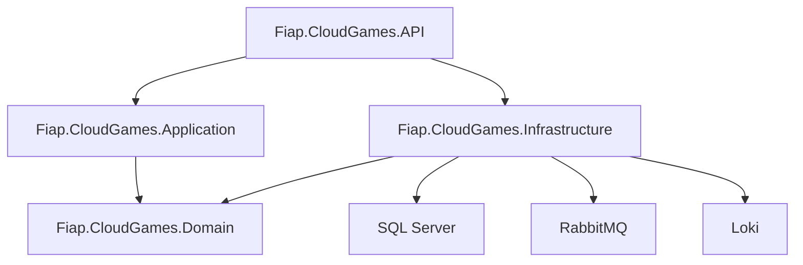

# Tech Challenge - FIAP Cloud Games - 10NETT - Grupo 30 - Fase 2


[](https://github.com/FIAP-10NETT-Grupo-30/cloud-games-fase-2-users/tags)

## Microsserviço de Usuários (UsersAPI)

Este repositório contém o **Microsserviço de Usuários** da aplicação FIAP Cloud Games, responsável por cadastro, autenticação (geração de token JWT) e autorização de usuários na arquitetura de microsserviços orientada a eventos.

---

## Sumário 📝

- Documentos
  - [Instruções TC Fase 2 (Repositório de Orquestração)](https://github.com/FIAP-10NETT-Grupo-30/cloud-games-fase-2-orchestration/blob/main/docs/TC-NETT-FASE-2.md)
  - [Processo de Colaboração (Repositório de Orquestração)](https://github.com/FIAP-10NETT-Grupo-30/cloud-games-fase-2-orchestration/blob/main/docs/PROCESSO-COLABORACAO.md)
  - [Fluxos (Repositório de Orquestração)](https://github.com/FIAP-10NETT-Grupo-30/cloud-games-fase-2-orchestration/blob/main/docs/Fluxos/README.md)
  - [Kubernetes](./k8s/README.md)
- [Sobre este Microsserviço](#sobre-este-microsservico)
  - [Responsabilidades](#responsabilidades)
  - [Eventos Publicados](#eventos-publicados)
- [Como rodar o projeto](#como-rodar-o-projeto)
  - [Pré-requisitos](#pre-requisitos)
  - [Executando localmente com Docker Compose](#executando-localmente-com-docker-compose)
  - [Executando localmente com .NET](#executando-localmente-com-net)
  - [Deploy no Kubernetes](#deploy-no-kubernetes)
- [Estrutura de Pastas](#estrutura-de-pastas)
- [Arquitetura do Projeto](#arquitetura-do-projeto)
- [Variáveis de Ambiente](#variaveis-de-ambiente)
- [Endpoints da API](#endpoints-da-api)

---

<a id="sobre-este-microsservico"></a>
## Sobre este Microsserviço 🎯

<a id="responsabilidades"></a>
### Responsabilidades

O **Microsserviço de Usuários** é responsável por:

- ✅ **Cadastro de Usuários**: Gerenciamento completo do CRUD de usuários (registro, criação por admin, atualização, exclusão)
- ✅ **Autenticação**: Geração de tokens JWT para acesso aos serviços
- ✅ **Autorização**: Validação de permissões e roles (Administrator/User)
- ✅ **Gestão de Acesso**: Confirmação de email, primeiro acesso, recuperação de senha
- ✅ **Publicação de Eventos**: Notificação de outros serviços sobre ações de usuários

<a id="eventos-publicados"></a>
### Eventos Publicados

Este microsserviço publica os seguintes eventos na fila `users.events`:

| Evento | Quando é Publicado | Dados |
|--------|-------------------|-------|
| `UserSignedUpEvent` | Quando um usuário se cadastra | `Id`, `Name`, `Email`, `ConfirmationToken` |
| `UserEmailConfirmedEvent` | Quando o email é confirmado | `Id`, `Name`, `Email` |
| `UserInvitedEvent` | Quando um admin cria um usuário | `Id`, `Name`, `Email`, `FirstAccessToken` |
| `UserFirstAccessedEvent` | Quando o primeiro acesso é realizado | `Id`, `Name`, `Email` |
| `UserForgotPasswordEvent` | Quando solicita recuperação de senha | `Id`, `Name`, `Email`, `ResetToken` |
| `UserPasswordResetedEvent` | Quando a senha é redefinida | `Id`, `Name`, `Email` |

> **Nota**: O microsserviço de Notificações consome esses eventos para enviar emails aos usuários.

---

<a id="como-rodar-o-projeto"></a>
## Como rodar o projeto ▶️

<a id="pre-requisitos"></a>
### Pré-requisitos ⚙️

- [Git](https://git-scm.com/downloads) instalado na sua máquina
- [Docker Desktop](https://www.docker.com/get-started) instalado e em execução
- [.NET 8 SDK](https://dotnet.microsoft.com/en-us/download/dotnet/8.0) ou superior (para execução local sem Docker)
- [DBeaver](https://dbeaver.io/download/) ou outro cliente de banco de dados compatível com SQL Server

<a id="executando-localmente-com-docker-compose"></a>
### Executando localmente com Docker Compose ⚡

**A forma recomendada de executar a aplicação completa é através do [Repositório de Orquestração](https://github.com/FIAP-10NETT-Grupo-30/cloud-games-fase-2-orchestration)**, que contém todos os docker-compose files e scripts necessários. 

Consulte o [guia de execução com Docker Compose](https://github.com/FIAP-10NETT-Grupo-30/cloud-games-fase-2-orchestration/blob/main/docs/Compose/README.md) no repositório de orquestração. 

<a id="executando-localmente-com-net"></a>
### Executando localmente com .NET 🔧

Para desenvolvimento local sem Docker: 

1. Clone o repositório:
   ```bash
   git clone https://github.com/FIAP-10NETT-Grupo-30/cloud-games-fase-2-users.git
   cd cloud-games-fase-2-users
   ```

2. Restaurar as ferramentas do .NET:
   ```bash
   dotnet tool restore
   ```

3. Configurar o User Secrets (alternativa ao .env para desenvolvimento):
   ```bash
   cd src/Fiap.CloudGames.API
   dotnet user-secrets init
   
   # Configurar as secrets necessárias (veja seção "Variáveis de Ambiente")
   dotnet user-secrets set "ConnectionStrings:DefaultConnection" "Server=localhost,1433;Database=CloudGamesUsers;User Id=sa;Password=SuaSenha;TrustServerCertificate=True;"
   dotnet user-secrets set "RabbitMq:HostName" "localhost"
   dotnet user-secrets set "RabbitMq:UserName" "guest"
   dotnet user-secrets set "RabbitMq:Password" "guest"
   dotnet user-secrets set "Jwt:Secret" "sua-chave-secreta-jwt-com-pelo-menos-32-caracteres"
   dotnet user-secrets set "Jwt:Issuer" "cloud-games"
   dotnet user-secrets set "Jwt:Audience" "cloud-games-audience"
   dotnet user-secrets set "AdminUser:Email" "admin@dev.local"
   dotnet user-secrets set "AdminUser:Password" "Change_me_!234"
   dotnet user-secrets set "AdminUser:Name" "Administrador"
   dotnet user-secrets set "AdminUser:Role" "Administrator"
   dotnet user-secrets set "AdminUser:Status" "Active"
   dotnet user-secrets set "AdminUser:EmailConfirmed" "true"
   ```

4. Garantir que a infraestrutura esteja rodando (SQL Server e RabbitMQ):
   ```bash
   # Volte ao diretório de orquestração e suba apenas a infraestrutura
   cd ../../cloud-games-fase-2-orchestration
   docker-compose -f docker-compose.infra.yaml up -d
   ```

5. Aplicar as migrações do banco de dados: 
   ```bash
   cd ../cloud-games-fase-2-users
   dotnet ef database update --project src/Fiap.CloudGames.Infrastructure --startup-project src/Fiap.CloudGames.API --context AppDbContext
   ```

6. Executar a aplicação:
   ```bash
   dotnet run --project src/Fiap.CloudGames.API
   ```

7. Acessar o Swagger: 
   ```
   http://localhost:30080/swagger/index.html 
   ```

<a id="deploy-no-kubernetes"></a>
### Deploy no Kubernetes ☸️

Consulte a [documentação de Kubernetes](./k8s/README.md) para instruções detalhadas sobre como fazer deploy do microsserviço em um cluster Kubernetes local. 

Resumo dos comandos: 

```bash
# Build da imagem Docker
docker build -t cloud-games-users-svc:latest .

# Aplicar os manifestos (na ordem correta)
kubectl apply -f k8s/fcg-apps-namespace.yaml
kubectl apply -f k8s/externalnames-service.yaml
kubectl apply -f k8s/users-secret.yaml
kubectl apply -f k8s/users-configmap.yaml
kubectl apply -f k8s/users-service.yaml
kubectl apply -f k8s/users-deployment.yaml

# Verificar o status
kubectl get pods -n fcg-apps
kubectl get services -n fcg-apps
```

---

<a id="estrutura-de-pastas"></a>
## Estrutura de Pastas 📁

```
├── .config/
│   └── dotnet-tools.json              # Configurações de ferramentas do .NET CLI (EF Core)
│
├── k8s/                                # Manifests do Kubernetes
│   ├── templates/                      # Templates de exemplo para secrets
│   ├── fcg-apps-namespace.yaml         # Namespace do Kubernetes
│   ├── externalnames-service.yaml      # ExternalNames para SQL Server, RabbitMQ e Loki
│   ├── users-secret.yaml               # Secrets (não comitado - use o template)
│   ├── users-configmap.yaml            # ConfigMaps com configurações não sensíveis
│   ├── users-service.yaml              # Service do Kubernetes (NodePort)
│   ├── users-deployment.yaml           # Deployment do Kubernetes
│   └── README.md                       # Documentação detalhada do Kubernetes
│
├── src/
│   ├── Fiap.CloudGames.API/           # Camada de API
│   │   ├── Controllers/                # Controllers REST
│   │   │   └── UsersController.cs      # Endpoints de usuários
│   │   └── Program.cs                  # Ponto de entrada da aplicação
│   │
│   ├── Fiap.CloudGames.Application/   # Serviços de aplicação e casos de uso
│   │   └── Users/                      # Contexto de Usuários
│   │       ├── Services/               # Serviços de negócio (UserService, IUserService)
│   │       ├── Events/                 # Eventos publicados (UserSignedUpEvent, etc)
│   │       ├── Dtos/                   # Data Transfer Objects
│   │       └── Validators/             # Validadores FluentValidation
│   │
│   ├── Fiap.CloudGames.Domain/        # Entidades, Value Objects, Enums e Interfaces
│   │   └── Users/
│   │       ├── Entities/               # Entidade User
│   │       ├── Enums/                  # Enumerações (UserRole, UserStatus)
│   │       ├── Interfaces/             # Interface do JwtService
│   │       ├── Options/                # Options (AdminUserOptions, JwtOptions)
│   │       ├── Repositories/           # Contrato IUserRepository
│   │       └── ValueObjects/           # Value Objects (Email, Password)
│   │
│   └── Fiap.CloudGames.Infrastructure/ # Implementações de persistência e integrações
│       ├── Persistence/                # EF Core, Migrations, Repositories
│       │   ├── EntityConfigurations/   # Configurações do EF Core
│       │   ├── Migrations/             # Migrações do banco de dados
│       │   └── AppDbContext.cs         # DbContext
│       ├── Users/
│       │   ├── Repositories/           # Implementação do UserRepository
│       │   ├── Seeders/                # Seeder de usuário admin
│       │   └── Services/               # Implementação do JwtService
│       └── DependencyInjection.cs      # Configuração de dependências
│
├── tests/
│   └── Fiap.CloudGames.Tests/         # Testes Unitários
│
├── .dockerignore                       # Arquivo para ignorar arquivos no build do Docker
├── .editorconfig                       # Configurações do Editor
├── .gitattributes                      # Configurações do Git
├── .gitignore                          # Arquivo para ignorar arquivos no Git
├── Dockerfile                          # Arquivo Dockerfile para build da imagem
├── cloud-games-fase-2-users.sln       # Solução do Visual Studio
├── global.json                         # Versão do .NET SDK
└── README.md                           # Este arquivo
```

---

<a id="arquitetura-do-projeto"></a>
## Arquitetura do Projeto 🏛️

Este microsserviço segue uma **arquitetura em camadas** (Clean Architecture / Onion Architecture), separando as responsabilidades e facilitando a manutenção e testes.

### Principais Camadas

- **API (Fiap.CloudGames.API)**: Controllers REST, configuração de pipeline HTTP, Swagger e autenticação JWT
- **Application (Fiap.CloudGames.Application)**: Serviços de aplicação, casos de uso, DTOs, eventos e validadores
- **Domain (Fiap.CloudGames.Domain)**: Entidades, value objects, enums e interfaces (contratos)
- **Infrastructure (Fiap.CloudGames.Infrastructure)**: Implementações concretas de persistência (EF Core), autenticação (JWT), mensageria (RabbitMQ/MassTransit) e seeders

### Tecnologias Utilizadas

- **Framework**:  .NET 8
- **Banco de Dados**: SQL Server com Entity Framework Core
- **Mensageria**: RabbitMQ com MassTransit
- **Autenticação**: JWT (JSON Web Tokens)
- **Hash de Senhas**: BCrypt.Net-Next
- **Logging**: Serilog com sink para Grafana Loki
- **Documentação**: Swagger/OpenAPI
- **Containerização**: Docker (multi-stage build)
- **Orquestração**: Kubernetes

### Diagrama de Dependências



### Bibliotecas Principais

- `Microsoft.EntityFrameworkCore.SqlServer` - Provedor SQL Server para EF Core
- `Microsoft.AspNetCore.Authentication.JwtBearer` - Autenticação JWT
- `MassTransit.RabbitMQ` - Mensageria com RabbitMQ
- `Swashbuckle.AspNetCore` - Geração de documentação Swagger
- `Serilog.AspNetCore` - Logging estruturado
- `Serilog.Sinks.Grafana.Loki` - Sink do Serilog para Loki
- `BCrypt.Net-Next` - Hashing de senhas
- `FluentValidation` - Validação fluente
- `FluentValidation.AspNetCore` - Integração do FluentValidation com ASP.NET Core

---

<a id="variaveis-de-ambiente"></a>
## Variáveis de Ambiente 🔐

### Configurações Sensíveis (Secrets)

Estas variáveis devem ser configuradas via **User Secrets** (desenvolvimento local) ou **Kubernetes Secrets** (produção/cluster):

| Variável | Descrição | Exemplo |
|----------|-----------|---------|
| `ConnectionStrings__DefaultConnection` | Connection string do SQL Server | `Server=sqlserver-service,1433;Database=CloudGamesUsers;User Id=sa;Password=***;TrustServerCertificate=True;` |
| `RabbitMq__HostName` | Hostname do RabbitMQ | `rabbitmq-service` |
| `RabbitMq__UserName` | Usuário do RabbitMQ | `guest` |
| `RabbitMq__Password` | Senha do RabbitMQ | `***` |
| `Jwt__Secret` | Chave secreta para geração de tokens JWT (mínimo 32 caracteres) | `sua-chave-super-secreta-com-pelo-menos-32-caracteres` |
| `Jwt__Issuer` | Emissor do token JWT | `cloud-games` |
| `Jwt__Audience` | Audiência do token JWT | `cloud-games-audience` |
| `AdminUser__Email` | Email do usuário administrador (seed) | `admin@dev.local` |
| `AdminUser__Password` | Senha do usuário administrador (seed) | `Change_me_!234` |
| `AdminUser__Name` | Nome do usuário administrador (seed) | `Administrador` |
| `AdminUser__Role` | Role do usuário administrador | `Administrator` |
| `AdminUser__Status` | Status do usuário administrador | `Active` |
| `AdminUser__EmailConfirmed` | Se o email do admin está confirmado | `true` |

### Configurações Não Sensíveis (ConfigMaps)

Estas variáveis podem ser configuradas via **appsettings.json** (desenvolvimento) ou **Kubernetes ConfigMaps** (cluster):

| Variável | Descrição | Valor Padrão |
|----------|-----------|--------------|
| `ASPNETCORE_ENVIRONMENT` | Ambiente de execução | `Development` / `Production` |
| `Queues__Users__Commands` | Nome da fila de comandos de usuários | `users.commands` |
| `Queues__Users__Events` | Nome da fila de eventos de usuários | `users.events` |
| `Loki__Url` | URL do servidor Loki para logging | `http://loki-service:3100` |
| `Jwt__ExpiryMinutes` | Tempo de expiração do token JWT em minutos | `60` |

> ⚠️ **Importante**: Nunca comite arquivos contendo secrets reais no controle de versão.  Use sempre os templates disponíveis em `k8s/templates/`.

---

<a id="endpoints-da-api"></a>
## Endpoints da API 🌐

### Autenticação

| Método | Endpoint | Descrição | Autenticação |
|--------|----------|-----------|--------------|
| `POST` | `/api/Users/login` | Autentica usuário e retorna JWT | ❌ Não |

**Body (Login):**
```json
{
  "email": "admin@dev.local",
  "password": "Change_me_!234"
}
```

**Response:**
```json
{
  "token": "eyJhbGciOiJIUzI1NiIsInR5cCI6IkpXVCJ9...",
  "expiresAt": "2026-01-19T12:00:00Z"
}
```

### Gerenciamento de Usuários

| Método | Endpoint | Descrição | Autenticação |
|--------|----------|-----------|--------------|
| `GET` | `/api/Users` | Lista todos os usuários | ✅ Administrator |
| `GET` | `/api/Users/{id}` | Obtém um usuário por ID | ✅ Administrator |
| `GET` | `/api/Users/me` | Obtém dados do usuário autenticado | ✅ Sim |
| `POST` | `/api/Users/register` | Auto-cadastro de novo usuário | ❌ Não |
| `POST` | `/api/Users` | Cria usuário por administrador | ✅ Administrator |
| `DELETE` | `/api/Users/{id}` | Soft-delete de usuário | ✅ Administrator |
| `POST` | `/api/Users/{id}/restore` | Restaura usuário deletado | ✅ Administrator |

**Body (Registro):**
```json
{
  "name": "João Silva",
  "email": "joao@example.com",
  "password":  "Password123!"
}
```

**Body (Criação por Admin):**
```json
{
  "name": "Maria Santos",
  "email": "maria@example.com",
  "role": "User"
}
```

### Gestão de Acesso

| Método | Endpoint | Descrição | Autenticação |
|--------|----------|-----------|--------------|
| `POST` | `/api/Users/confirm` | Confirma email com token | ❌ Não |
| `POST` | `/api/Users/first-access` | Define senha no primeiro acesso | ❌ Não |
| `POST` | `/api/Users/forgot-password` | Solicita recuperação de senha | ❌ Não |
| `POST` | `/api/Users/reset-password` | Redefine senha com token | ❌ Não |

**Body (Confirmar Email):**
```json
{
  "token": "confirmation-token-received-by-email"
}
```

**Body (Primeiro Acesso):**
```json
{
  "token": "first-access-token-received-by-email",
  "newPassword": "MyNewPassword123!"
}
```

**Body (Esqueci a Senha):**
```json
{
  "email": "user@example.com"
}
```

**Body (Redefinir Senha):**
```json
{
  "token":  "reset-token-received-by-email",
  "newPassword": "MyNewPassword123!"
}
```

### Health Checks

| Método | Endpoint | Descrição |
|--------|----------|-----------|
| `GET` | `/health/live` | Verifica se o serviço está vivo (liveness probe) |
| `GET` | `/health/ready` | Verifica se o serviço está pronto (readiness probe) |

---

## Repositórios Relacionados 🔗

- **[Orquestração](https://github.com/FIAP-10NETT-Grupo-30/cloud-games-fase-2-orchestration)**: Docker Compose e Kubernetes para toda a infraestrutura
- **[Catálogo](https://github.com/FIAP-10NETT-Grupo-30/cloud-games-fase-2-catalog)**: Microsserviço de gerenciamento de jogos
- **[Pagamentos](https://github.com/FIAP-10NETT-Grupo-30/cloud-games-fase-2-payments)**: Microsserviço de processamento de pagamentos
- **[Notificações](https://github.com/FIAP-10NETT-Grupo-30/cloud-games-fase-2-notifications)**: Microsserviço de envio de notificações