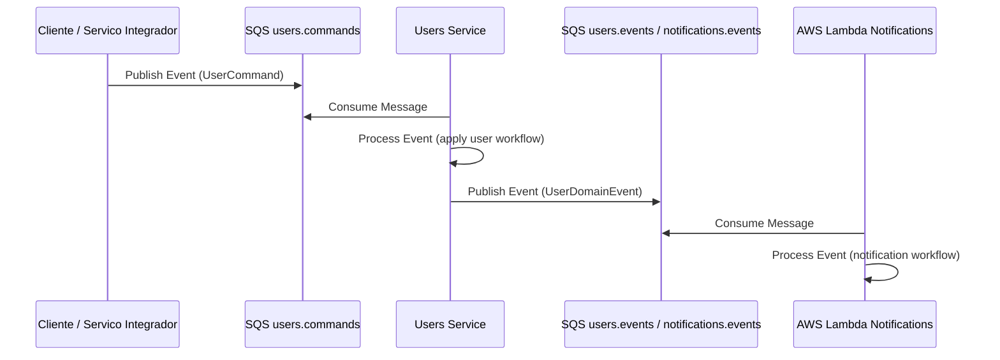
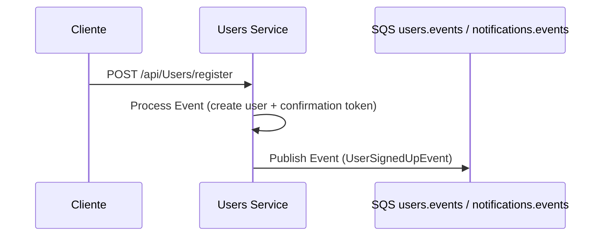
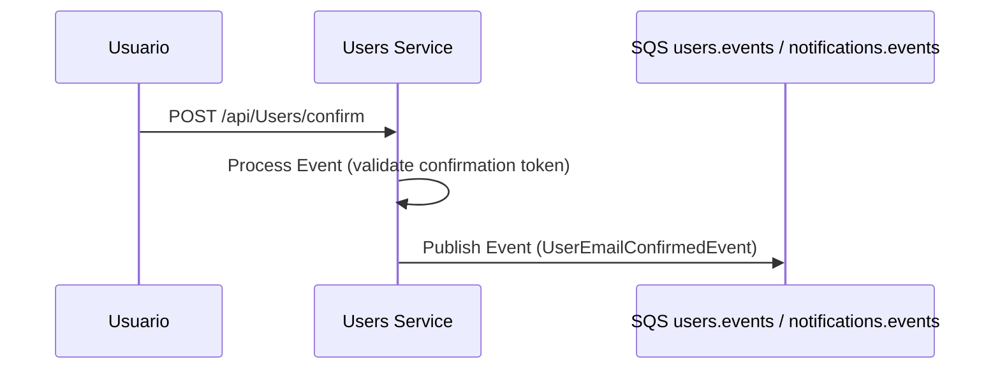
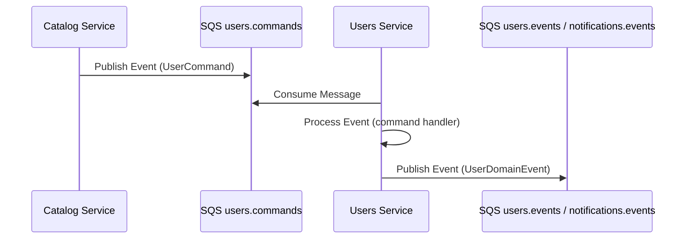

# FIAP Cloud Games - Microsservico de Usuarios (Fase 3)


[](https://github.com/FIAP-10NETT-Grupo-30/cloud-games-fase-3-users/tags)

Microsservico responsavel pelo ciclo de vida de usuarios da plataforma FIAP Cloud Games: cadastro, autenticacao, autorizacao, recuperacao de conta e publicacao de eventos de dominio para os demais servicos em arquitetura orientada a eventos na AWS.

## Sumario

- [Arquitetura AWS (Fase 3)](#arquitetura-aws-fase-3)
- [Diagrama de Arquitetura](#diagrama-de-arquitetura)
- [Fluxo Assincrono](#fluxo-assincrono)
- [Responsabilidades do Servico](#responsabilidades-do-servico)
- [Fluxos de Integracao](#fluxos-de-integracao)
- [Como Rodar Local (.NET)](#como-rodar-local-net)
- [Deploy AWS (Orchestration)](#deploy-aws-orchestration)
- [Estrutura de Pastas](#estrutura-de-pastas)
- [Arquitetura (Clean Architecture)](#arquitetura-clean-architecture)
- [Tecnologias Utilizadas](#tecnologias-utilizadas)
- [Variaveis de Ambiente](#variaveis-de-ambiente)
- [Repositorios Relacionados](#repositorios-relacionados)

---

## Arquitetura AWS (Fase 3)

A entrega da Fase 3 e executada integralmente em AWS, com deploy de servicos conteinerizados, mensageria assincrona e processamento orientado a eventos.

Servicos AWS utilizados:

- Amazon ECR para versionamento e armazenamento de imagens
- Amazon ECS com Fargate para execucao do microsservico
- Amazon SQS para filas e intercambio assincrono de mensagens
- AWS Lambda para processamento de notificacoes orientadas a evento
- Amazon CloudWatch para logs, metricas e observabilidade operacional
- Terraform (via repositorio de orquestracao) para provisionamento de infraestrutura

---

## Fluxo Assincrono



---

## Responsabilidades do Servico

- Registrar usuarios (self-signup)
- Autenticar usuarios com JWT
- Autorizar acesso por role (Administrator/User)
- Processar confirmacao de email, primeiro acesso e recuperacao de senha
- Gerenciar operacoes administrativas de usuarios
- Publicar eventos de dominio em filas SQS para integracao com outros servicos
- Expor endpoints HTTP para operacoes sincronas de usuarios

Eventos de dominio publicados:

- UserSignedUpEvent
- UserEmailConfirmedEvent
- UserInvitedEvent
- UserFirstAccessedEvent
- UserForgotPasswordEvent
- UserPasswordResetedEvent

---

## Fluxos de Integracao

### 1. Cadastro e notificacao de novo usuario



Entrada:

- Endpoint: POST /api/Users/register
- Body: UserRegisterDto
- Campos: name, email, password

Saida:

- Queue: users.events e notifications.events
- Event: UserSignedUpEvent
- Campos: Id, Name, Email, ConfirmationToken

### 2. Processamento de confirmacao de email



Entrada:

- Endpoint: POST /api/Users/confirm
- Body: ConfirmEmailDto
- Campo: token

Saida:

- Queue: users.events e notifications.events
- Event: UserEmailConfirmedEvent
- Campos: Id, Name, Email

### 3. Consumo de comandos assincronos de usuarios



Entrada:

- Queue: users.commands
- Message: UserCommand
- Campos: variam por tipo de comando

Saida:

- Queue: users.events e notifications.events
- Event: UserDomainEvent
- Campos: variam por tipo de evento

---

## Como Rodar Local (.NET)

### Pre-requisitos

- Git
- .NET SDK 10+
- SQL Server acessivel para a aplicacao
- dotnet-ef (restaurado via tool manifest)

### Execucao local

1. Clonar o repositorio

   ```bash
   git clone https://github.com/FIAP-10NETT-Grupo-30/cloud-games-fase-3-users.git
   cd cloud-games-fase-3-users
   ```

2. Restaurar ferramentas e dependencias

   ```bash
   dotnet tool restore
   dotnet restore ./cloud-games-fase-3-users.sln
   ```

3. Configurar secrets locais

   ```bash
   cd src/Fiap.CloudGames.API
   dotnet user-secrets init

   dotnet user-secrets set "ConnectionStrings:DefaultConnection" "Server=localhost,1433;Database=CloudGamesUsers;User Id=sa;Password=SuaSenha;TrustServerCertificate=True;"
   dotnet user-secrets set "Jwt:Secret" "sua-chave-super-secreta-com-pelo-menos-32-caracteres"
   dotnet user-secrets set "Jwt:Issuer" "cloud-games"
   dotnet user-secrets set "Jwt:Audience" "cloud-games-audience"
   dotnet user-secrets set "Jwt:ExpiryMinutes" "60"

   dotnet user-secrets set "Queues:Users:Commands" "users.commands"
   dotnet user-secrets set "Queues:Users:Events" "users.events"
   dotnet user-secrets set "Queues:Notifications:Events" "notifications.events"

   dotnet user-secrets set "AWS:Region" "us-east-1"
   dotnet user-secrets set "AWS:AccessKeyId" "your-local-access-key"
   dotnet user-secrets set "AWS:SecretAccessKey" "your-local-secret-key"

   dotnet user-secrets set "AdminUser:Email" "admin@dev.local"
   dotnet user-secrets set "AdminUser:Password" "Change_me_!234"
   dotnet user-secrets set "AdminUser:Name" "Administrador"
   dotnet user-secrets set "AdminUser:Role" "Administrator"
   dotnet user-secrets set "AdminUser:Status" "Active"
   dotnet user-secrets set "AdminUser:EmailConfirmed" "true"
   ```

4. Aplicar migracoes

   ```bash
   cd ../../
   dotnet ef database update --project src/Fiap.CloudGames.Infrastructure --startup-project src/Fiap.CloudGames.API --context AppDbContext
   ```

5. Executar o servico

   ```bash
   dotnet run --project src/Fiap.CloudGames.API
   ```

6. Validar endpoints

- Swagger UI: http://localhost:5190/swagger
- OpenAPI JSON: http://localhost:5190/swagger/v1/swagger.json
- Health check live: http://localhost:5190/health/live
- Health check ready: http://localhost:5190/health/ready

---

## Deploy AWS (Orchestration)

Provisionamento, pipelines e infraestrutura de execucao em AWS estao centralizados no repositorio de orquestracao:

- https://github.com/FIAP-10NETT-Grupo-30/cloud-games-fase-3-orchestration-aws

---

## Estrutura de Pastas

```text
.
├── src/
│   ├── Fiap.CloudGames.API/
│   │   ├── Controllers/
│   │   ├── Middlewares/
│   │   └── Program.cs
│   ├── Fiap.CloudGames.Application/
│   │   └── Users/
│   │       ├── Dtos/
│   │       ├── Events/
│   │       ├── Services/
│   │       └── Validators/
│   ├── Fiap.CloudGames.Domain/
│   │   └── Users/
│   │       ├── Entities/
│   │       ├── Enums/
│   │       ├── Interfaces/
│   │       ├── Options/
│   │       ├── Repositories/
│   │       └── ValueObjects/
│   └── Fiap.CloudGames.Infrastructure/
│       ├── Auth/
│       ├── Persistence/
│       └── Users/
├── tests/
│   └── Fiap.CloudGames.Tests/
├── Dockerfile
├── cloud-games-fase-3-users.sln
└── README.md
```

---

## Arquitetura (Clean Architecture)

O microsservico adota Clean Architecture para isolamento de responsabilidades e evolucao segura de regras de negocio.

Camadas:

- API: exposicao HTTP, pipeline e bootstrap
- Application: casos de uso, handlers, eventos e contratos de aplicacao
- Domain: entidades, enums, value objects e contratos de dominio
- Infrastructure: persistencia, autenticacao JWT e implementacoes tecnicas
- Tests: cobertura de regras e fluxos criticos

---

## Tecnologias Utilizadas

- .NET 10 / ASP.NET Core
- Entity Framework Core (SQL Server)
- AWS SDK for .NET (SQS)
- AWS Lambda (.NET)
- Amazon ECS Fargate
- Amazon ECR
- Amazon SQS
- Amazon CloudWatch
- Terraform (repositorio de orquestracao)
- Swagger / OpenAPI
- Serilog

---

## Variaveis de Ambiente

### Runtime da aplicacao

| Variavel | Descricao | Exemplo |
|---|---|---|
| ASPNETCORE_ENVIRONMENT | Ambiente de execucao | Development |
| RUN_DB_MIGRATIONS_ON_STARTUP | Executa migracoes ao iniciar | true |
| ConnectionStrings__DefaultConnection | Connection string do banco de dados | Server=localhost,1433;Database=CloudGamesUsers;User Id=sa;Password=***;TrustServerCertificate=True; |
| Jwt__Secret | Chave para assinatura JWT (minimo 32 chars) | sua-chave-super-secreta-com-pelo-menos-32-caracteres |
| Jwt__Issuer | Emissor do token JWT | cloud-games |
| Jwt__Audience | Audiencia do token JWT | cloud-games-audience |
| Jwt__ExpiryMinutes | Expiracao do token em minutos | 60 |
| Queues__Users__Commands | Nome da fila de comandos de usuarios | users.commands |
| Queues__Users__Events | Nome da fila de eventos de usuarios | users.events |
| Queues__Notifications__Events | Nome da fila de eventos de notificacoes | notifications.events |
| AWS__Region | Regiao AWS utilizada pelo servico | us-east-1 |
| AWS__AccessKeyId | Credencial AWS para execucao local | your-local-access-key |
| AWS__SecretAccessKey | Credencial AWS secreta para execucao local | your-local-secret-key |
| AdminUser__Email | Email do usuario administrador seed | admin@dev.local |
| AdminUser__Password | Senha do usuario administrador seed | Change_me_!234 |
| AdminUser__Name | Nome do usuario administrador seed | Administrador |
| AdminUser__Role | Role do usuario administrador | Administrator |
| AdminUser__Status | Status do usuario administrador | Active |
| AdminUser__EmailConfirmed | Email confirmado do admin seed | true |

---

## Repositorios Relacionados

- Orquestracao AWS: https://github.com/FIAP-10NETT-Grupo-30/cloud-games-fase-3-orchestration-aws
- Usuarios: https://github.com/FIAP-10NETT-Grupo-30/cloud-games-fase-3-users
- Catalogo: https://github.com/FIAP-10NETT-Grupo-30/cloud-games-fase-3-catalog
- Pagamentos: https://github.com/FIAP-10NETT-Grupo-30/cloud-games-fase-3-payments
- Notificacoes: https://github.com/FIAP-10NETT-Grupo-30/cloud-games-fase-3-notifications
